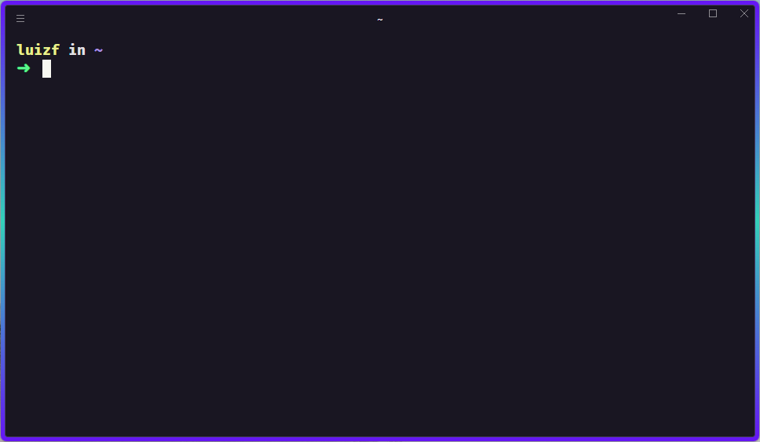

# Rocketseat Terminal 

<p align="center" >  </p>

<a href="https://blog.rocketseat.com.br/terminal-com-oh-my-zsh-spaceship-dracula-e-mais/">Link do post</a>


### Necessary packages:
```console
sudo apt install curl zsh git
```

### Install Dracula Theme or Aura Theme:

Dracula: https://draculatheme.com/ <br>

#### Aura-theme:
```console
hyper i hyper-aura-theme
```

### Install Oh My Zsh:
```console
sh -c "$(curl -fsSL https://raw.githubusercontent.com/ohmyzsh/ohmyzsh/master/tools/install.sh)"
```

### Install FiraCode Font:

https://github.com/tonsky/FiraCode/releases

### Installing Spaceship:

```console
git clone https://github.com/denysdovhan/spaceship-prompt.git "$ZSH_CUSTOM/themes/spaceship-prompt"
```

```console
ln -s "$ZSH_CUSTOM/themes/spaceship-prompt/spaceship.zsh-theme" "$ZSH_CUSTOM/themes/spaceship.zsh-theme"
```

### Edit in ~/.zshrc the theme for:

```console
ZSH_THEME="spaceship"
```

#### Add in ~/.zshrc

```console
SPACESHIP_PROMPT_ORDER=(
  user          # Username section
  dir           # Current directory section
  host          # Hostname section
  git           # Git section (git_branch + git_status)
  hg            # Mercurial section (hg_branch  + hg_status)
  node          # node version
  exec_time     # Execution time
  line_sep      # Line break
  vi_mode       # Vi-mode indicator
  jobs          # Background jobs indicator
  exit_code     # Exit code section
  char          # Prompt character
)
SPACESHIP_USER_SHOW=always
SPACESHIP_PROMPT_ADD_NEWLINE=false
SPACESHIP_CHAR_SYMBOL="❯"
SPACESHIP_CHAR_SUFFIX=" "
```

### Installing ZSH plugins:

```console
sh -c "$(curl -fsSL https://raw.githubusercontent.com/z-shell/zi-src/main/lib/sh/install.sh)"
```

#### Add in ~/.zshrc :

```console
zinit light zdharma/fast-syntax-highlighting
zinit light zsh-users/zsh-autosuggestions
zinit light zsh-users/zsh-completions
```

### Edit in ~/.zshrc the plugins for:

```console
plugins=(git nvm sudo web-search copypath history)
```

### Installing nvm:
```console
curl -o- https://raw.githubusercontent.com/nvm-sh/nvm/v0.39.1/install.sh | bash
wget -qO- https://raw.githubusercontent.com/nvm-sh/nvm/v0.39.1/install.sh | bash
```
#### Add in ~/.zshrc :

```console
export NVM_DIR="$([ -z "${XDG_CONFIG_HOME-}" ] && printf %s "${HOME}/.nvm" || printf %s "${XDG_CONFIG_HOME}/nvm")"
[ -s "$NVM_DIR/nvm.sh" ] && \. "$NVM_DIR/nvm.sh" # This loads nvm
```

### WSL remove background highlight in directories
#### Add in ~/.zshrc
```console
LS_COLORS+=':ow=01;33'
```
