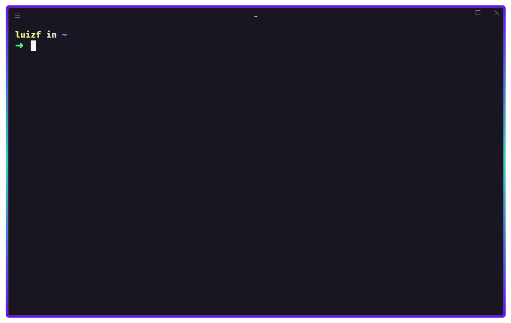

# - Rocketseat Terminal Customization



<hr>

Minhas personalizações do terminal <a href="https://hyper.is/">Hyper</a>, editadas do <a href="https://blog.rocketseat.com.br/terminal-com-oh-my-zsh-spaceship-dracula-e-mais/">artigo</a> criado pela <a href="https://www.rocketseat.com.br/">Rocketseat</a>.

O Hyper é um terminal de código aberto multiplataforma, com o intuito de criar uma experiência flexível e bonita para o usuário, possibilitando a utilização de plugins e temas.

**Lista de temas e plugins:** <a href="https://github.com/bnb/awesome-hyper">*awesome-hyper*</a>
<br>

<hr>

## 1- Instalando o Omni-theme
```console
hyper install hyper-omni-theme
```
Ou qualquer outro tema da sua escolha.

<br>

## 2- Instalando o Hyper borders e scrolbar

Edite no arquivo **.hyper.js** os plugins, e adicione o **hyperBoarder** dentro de config: <br>
- *Se quiser customizar a cor da borda, basta mudar os valores HEX de **borderColors:***

```javascript
module.exports = {
    config: {
        ...
        hyperBorder: {
            borderColors: ['#6514f5','#33d0b9', '#6514f5'],
            borderWidth: '6px'
        }
        ...
```

```javascript
plugins: ['hyper-omni-theme', 'hyperborder', 'hyper-dark-scrollbar'],
```
<br>

## 3- Instalando Oh My Zsh

Cole o comando no console e siga com a instalação
```console
sh -c "$(curl -fsSL https://raw.githubusercontent.com/ohmyzsh/ohmyzsh/master/tools/install.sh)"
```
<br>

## 4- Instalando a fonte "Fira Code" 
Baixe o <a href="https://github.com/tonsky/FiraCode/releases">Fira_Code_v*.zip</a> e instale as fontes. <br>
<br>

## 5- Instalando o Spaceship

**5.1** Clone o repositório do tema.
```console
git clone https://github.com/denysdovhan/spaceship-prompt.git "$ZSH_CUSTOM/themes/spaceship-prompt"
```
**5.2** Faça um link do simbólico do tema na pasta do zsh.
```console
git clone https://github.com/denysdovhan/spaceship-prompt.git "$ZSH_CUSTOM/themes/spaceship-prompt"
```

**5.3** Agora abra o ~/.zshrc com um editor de sua preferencia e edite o tema para:
```console
ZSH_THEME="spaceship"
```
**5.4** Neste mesmo arquivo, adicione as opções para desabilitar algumas das funções que consomem desempenho e fazer outras customizações.

```console
SPACESHIP_PROMPT_ORDER=(
  user          # Username section
  dir           # Current directory section
  host          # Hostname section
  git           # Git section (git_branch + git_status)
  hg            # Mercurial section (hg_branch  + hg_status)
  node          # node version
  exec_time     # Execution time
  line_sep      # Line break
  vi_mode       # Vi-mode indicator
  jobs          # Background jobs indicator
  exit_code     # Exit code section
  char          # Prompt character
)
SPACESHIP_USER_SHOW=always
SPACESHIP_PROMPT_ADD_NEWLINE=false
SPACESHIP_CHAR_SUFFIX=" "
```
Se quiser fazer a suas próprias customizações, existe a <a href="https://spaceship-prompt.sh/options/">documentação</a> do **Spaceship** para consulta.

**5.5** Instalando plugins do Zsh <br>
Procure no ~/.zshrc a parte dos plugins e adicione os seguintes:
```console
plugins=(git nvm sudo web-search copypath history)
```

**5.6** Reinicie o terminal para ver a mudança.

<br>

## 6- Instalando plugins Zinit
Antes de instalar os plugins, precisamos do <a href="https://z-shell.pages.dev/">ZI</a>, que facilita a instalação dos mesmos.

```console
sh -c "$(curl -fsSL https://raw.githubusercontent.com/z-shell/zi-src/main/lib/sh/install.sh)"
```

Agora adicionamos os plugins nas ultimas linhas do nosso arquivo **~/.zshrc**:

```console
zinit light zdharma/fast-syntax-highlighting
zinit light zsh-users/zsh-autosuggestions
zinit light zsh-users/zsh-completions
```
<br>

## 7- Instalando Node Version Manager
Execute os seguintes comandos.
```console
curl -o- https://raw.githubusercontent.com/nvm-sh/nvm/v0.39.1/install.sh | bash
wget -qO- https://raw.githubusercontent.com/nvm-sh/nvm/v0.39.1/install.sh | bash
```
Depois, adicione no final do seu arquivo **~/.zshrc**:
```console
export NVM_DIR="$([ -z "${XDG_CONFIG_HOME-}" ] && printf %s "${HOME}/.nvm" || printf %s "${XDG_CONFIG_HOME}/nvm")"
[ -s "$NVM_DIR/nvm.sh" ] && \. "$NVM_DIR/nvm.sh" # This loads nvm
```
<br>

## Opcional
Caso esteja utilizando o WSL, alguns diretórios podem aparecer com um background nas letras, dificultando a leitura.
Para conserta isso, adicione no final de seu arquivo **~/.zshrc**:
```console
LS_COLORS+=':ow=01;33'
```
